# Introduction to MIDI (Pt.1)

# What is MIDI anyway?

Musical Instrument Digital Interface or better known as MIDI, is a technical standard that allows digital instructions to be sent between electronic music instruments and computers. The infamous standard incorporates a communication protocol, a digital interface and electrical connectors which in combination allows the communication of a variety of audio devices. 
 
MIDI instructions consist of simple digital data only! These instructions transfer information about pitch, tempo and velocity of musical notes. There are no actual audio signals involved. This aspect alone makes MIDI really compact, editable and easy to move around because the consumed disk space is thousand times less compared to an equivalent recorded audio. Musicians all around the world use it to play, edit and record music! 

Here's a simple flowchart to help you understand how it works.

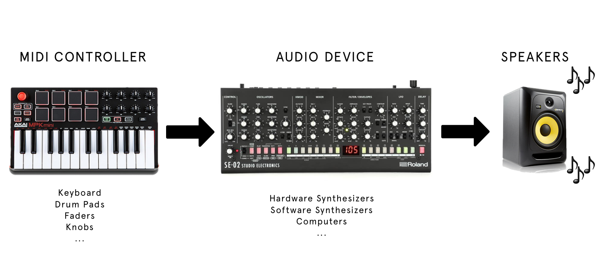

In simple terms, MIDI works like sheet music for electronic devices read and play. 

In more technical terms, MIDI messages work like computer code, they help generate and transfer instructions for electronic audio devices. A MIDI source, such as a keyboard, generates these instructions and through the MIDI cables, transfers them to an audio device. The audio device which is usually a synthesizer of some sort, in turn translates the instructions into real audio. 

The MIDI system is actually really similar to “player piano” if there any Western fans out there. Look closely to the sheet of paper that is rolling on the piano, you will see lines that are etched on it which instructs the mechanism which notes to play and for how long.  

### Player Piano

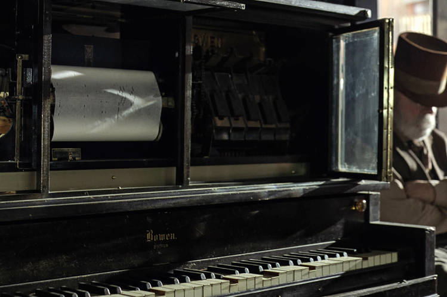

[The Entertainer on a player piano](https://www.youtube.com/watch?v=aseMAEctM1s)

Here’s how a MIDI file of Pokemon Red’s Pokecenter theme looks like on my Digital Audio Workstation. The annotations showcase some of the different types of information that can be transferred with MIDI.

This is how Ableton Live's piano roll looks like when I added the Pokecenter theme from the Pokemon Red game!

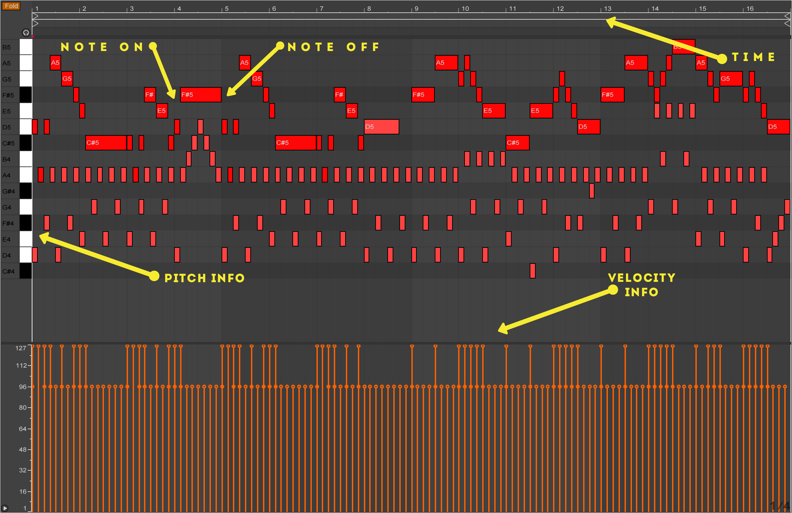

# Some History

As it turns out, there was no standardized way of connecting or synchronizing electronic music instruments manufactured by different companies in the early 1980s. Every manufacturer was trying to come up with their own way of communication between instruments. 

The founder of Roland, a company that has shaped the face of music multiple times in the last 50 years, Ikutaro Kakehashi felt that the lack of standardization was limiting the growth of the electronic music industry. He reached out to Sequential Circuits’s Dave Smith, another legendary name in the electronic music industry, about creating a cheap and simple standard in 1981. 

The initial standard was shown in November 1981 during the Audio Engineering Society and the first synthesizers that were equipped with MIDI hit the shelves in 1982. The rest was history! 

## Rolan Jupiter-6 one of the first two synthesizers with MIDI connectivity

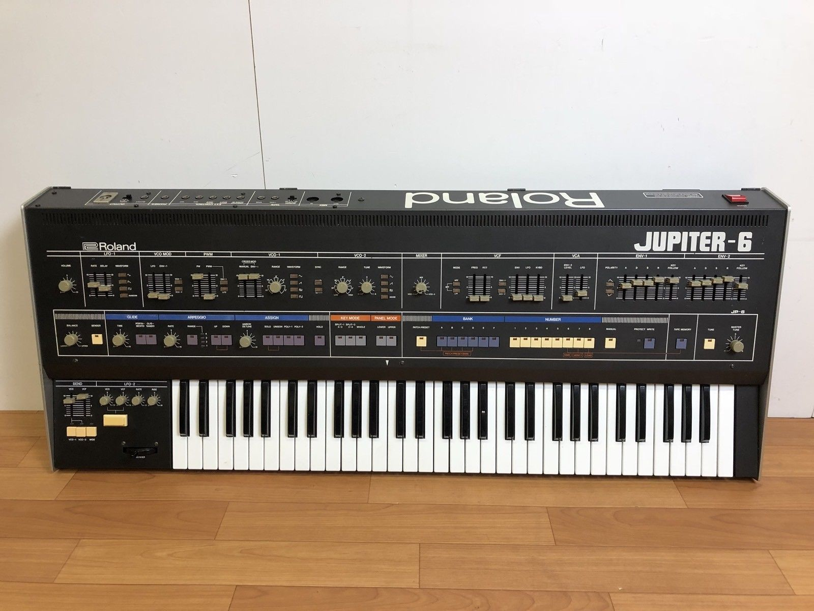

No wonder there was a techno boom in the early 1990s all around the world! 

# Working with MIDI

Here's where things start to get interesting! Let's look at how you can connect MIDI capable products to your own computer. 

### Things you will need

* Your computer
  * Any computer with a decent processor and RAM will do here but Digital Audio Workstation; aka DAWs, tend to get processing heavy as the number of intrument channels increase. Since we are going to work with basic stuff, you should be alright with your good old laptop.
* A Digitial Audio Workstation
  * There are a lot of Digital Audio Workstations or DAWs out there. I use Ableton Live. You might also encounter Apple's Logic Pro, Steinberg's Cubase, Apple's Garage Band, FL Studio, Presonus Studio One, Propellerhead Reason, Avid's Pro Tools.. The list goes on and on. People who are into music production use more than one as each of them have their own pros and cons. Unfortunately, most of them are paid applications but if you don't want to break your piggy bank, there are ways around this which I'm not going to get into here ;) Just do a little Google search! 
* A software synthesizer
  * Luckyl, most DAWs come with a bunch of software synthesizers to play with! There are also numerous software syhtnesizers out there in the digital world. Some are free but most of them aren't cheap. Watch some Youtube reviews to make up your mind if you are interested. 
* A MIDI Controller
  * Any controller with MIDI capabilities work here. I have a Novation Launchkey 49 USB Keyboard at the moment which I will be using during this tutorial but your MIDI device doesnt have to be a keyboard. For example, Akai Professional's Pad controllers are also really fun to play with. The Karg nanoKey family is a good place to start. If you want to go hard with a lot of controls such as trigger pads, faders and knobs you might look into Arturia's KeyLab mkII series. Be warned though, they are not cheap.
  * One thing to distinguish here! Most of the controllers that are available on the market today connect to your computer through USB. Most of them also have the original MIDI inputs and outputs but they are seldom used to connect to computers. They are mostly there to communciate to analog synthesizers. The glorious days of using the original MIDI connection to make music may be past but the you can still run into some MIDI cables here and there.
* A soundcard with MIDI Input (Optional / Read Details) 
  * If you don't have a USB connected controller, you need a device to convert those MIDI messages for your computer to understand wats happening. Most USB connected soundcard have MIDI input and output today. So you might as well get one fi you are going to play with your fathers MIDI controllers that are collecting dust in the attic. 
  * Getting a soundcard will help with the latency issues during your recordings and production as most computers cannot really cope well with digital-2-analog conversion of signals. 
  * I'm using Roland's Quadcapture for a while now. I like it and its a good place to start. If you want other options look into brands like M-Audio, Focusrite, MOTU. If you don't want to take my word for it Google is your biggest companinon into the world of electronic music production. 
* A Male-Male MIDI Cable (Optional / Read Details) 
  * As you might guess, if you have a USB connected MIDI controller, you can skip this step but its always good to have one as MIDI cables can come in handy in situations where you work with olders synthesizers. 
* USB Cable(s) (Not so optional!)
  * I think you started to get the idea here. If you have USB connected tools like your MIDI controller or your soundcard, you better have a USB cable to connect them to your computer. 
 
# Let's Get Down to Business

### Follow These 5 Easy Steps To Start Producing Music 

1. Connect Your Controller To Your Computer
  1. How to connect your USB Controller
    1. This one is pretty self explanatory! Just find the appropriate USB cable for your controller and plug it in to your computer!
  1. How to connect with a MIDI Cable
    1. Similar to the USB Controller option, just connect Your Soundcard Through USB!
    1. 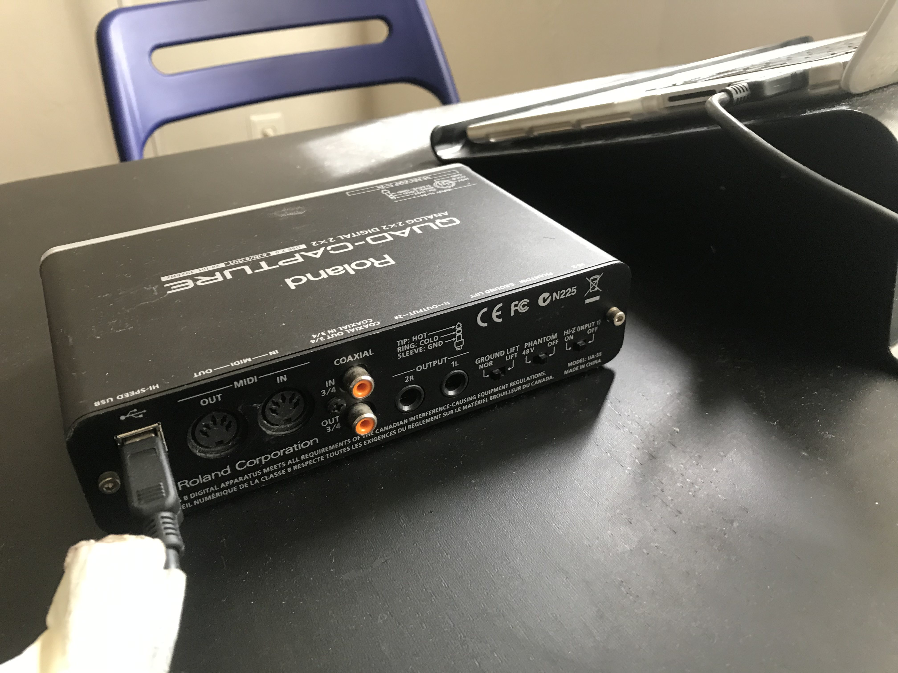
    1. Get your MIDI Cable & locate the MIDI Input
    1. 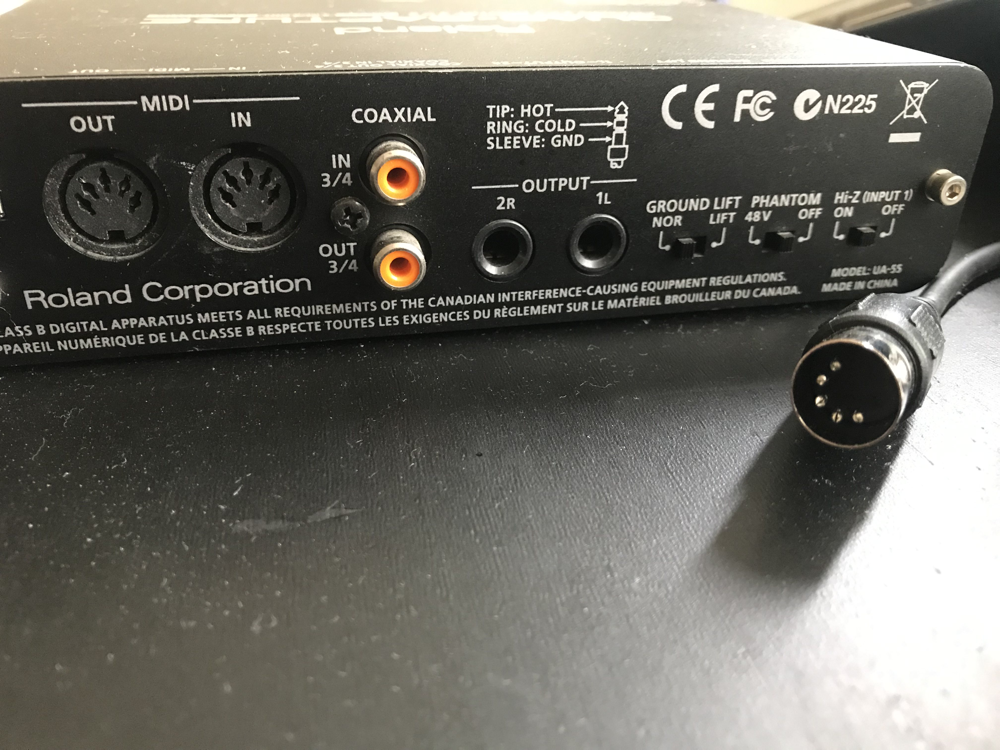
    1. Connect MIDI Cable to MIDI Input Pin of your soundcard
    1. 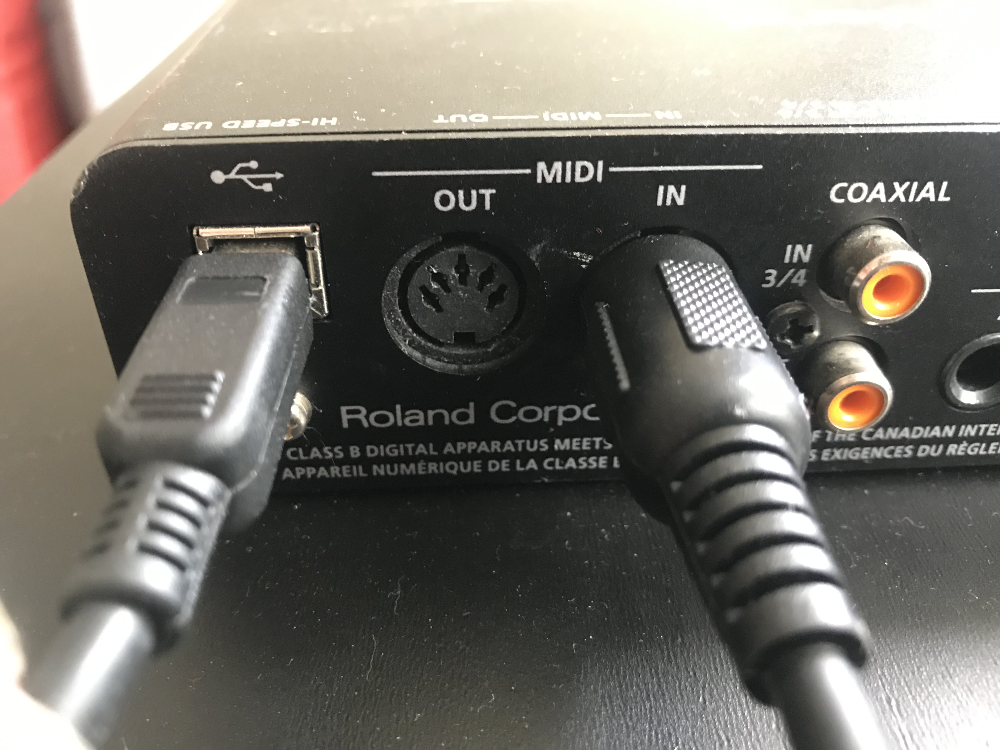
    1. Connect the other end of your MIDI cable to MIDI Output device
    1. 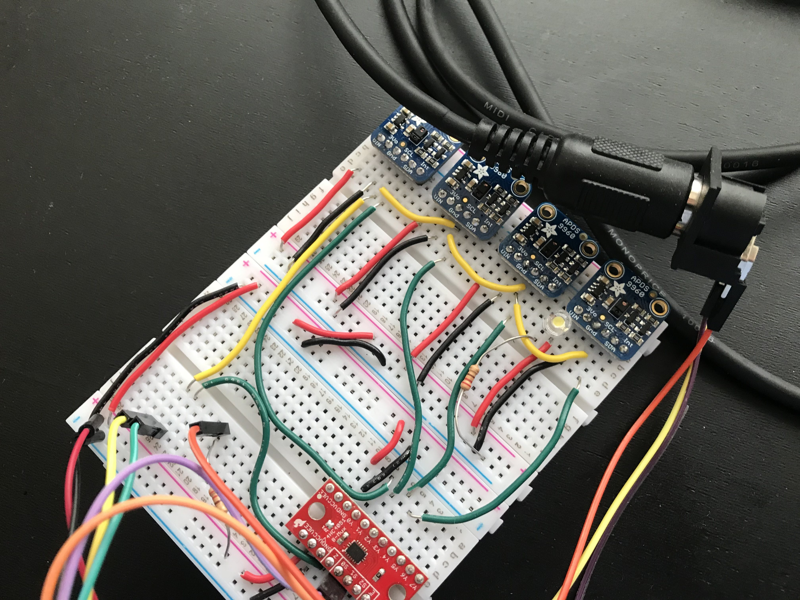
1. Go to your DAW of choice
  1. Open up your DAW of choice. I'm using Ableton Live 9 here and this is how it looks like when I start it up.
     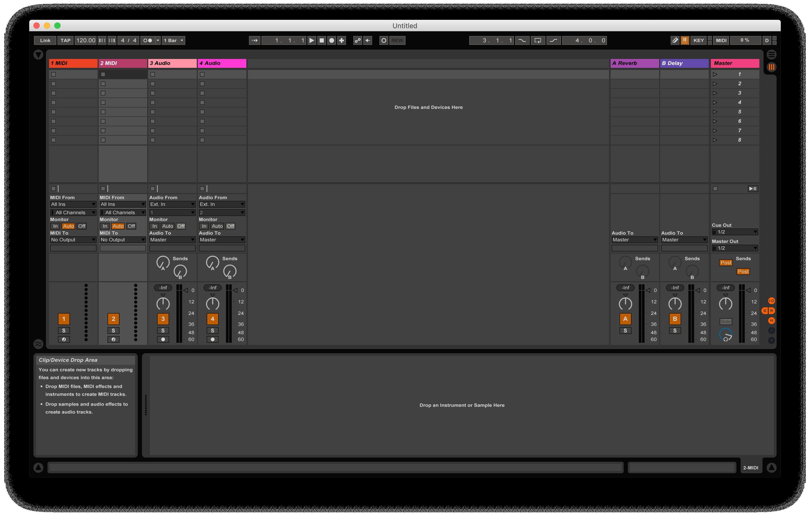
1. Throw your instrument of choice in the mix!
  1. Add your insturment of choice to the MIDI channel you want to work on your DAW. A simple drag and drop should work for Ableton. I used a instrument named Analog that ships with Ableton. 
     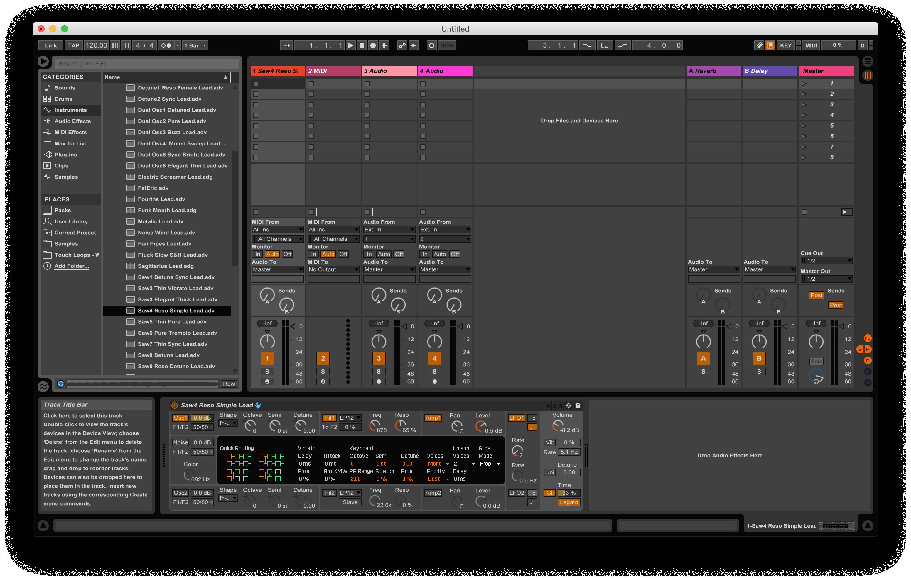
1. Fiddling With Settings
   1. Now we need to let our DAW know which MIDI device were are looking for.
   1. Look at the MIDI input settings on your MIDI channel.
   1. Choose the right controller for your input.
     1. My Novation controller that I hooked up through USB looks something like this.
     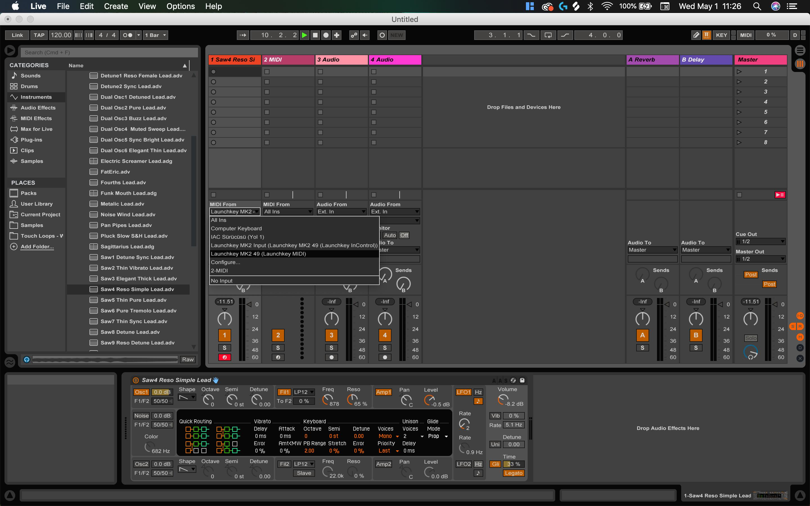
     1. If you are using a Soundcard to communicate the MIDI messages to your computer. You should look for your Soundcard's name there.
     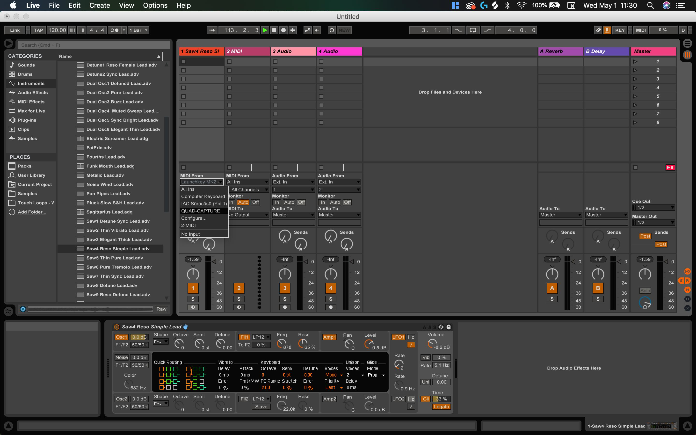
1. Start pushing some buttons
1. Make some noise!

If this sound to you easy we will look into making our own simple MIDI controller in the next! 

Use the link below to see how that's done. 

/// [2nd Part of Tutorial Here!](MIDI101_Pt2.md) ///

# Reading Material

[More on what MIDI is](https://blog.landr.com/what-is-midi/)

[Introduction to MIDI by the MIDI Association](https://www.midi.org/images/easyblog_articles/43/intromidi.pdf)

[Ableton Live](https://www.ableton.com/en/)

[Roland Quad-Capture](https://www.roland.com/us/products/quad-capture/)

[Novation Launchkey](https://novationmusic.com/keys/launchkey)

[The MIDI cable I recently bought](https://www.amazon.com/gp/product/B009GUP7U8/ref=ppx_yo_dt_b_asin_title_o05_s00?ie=UTF8&psc=1)

