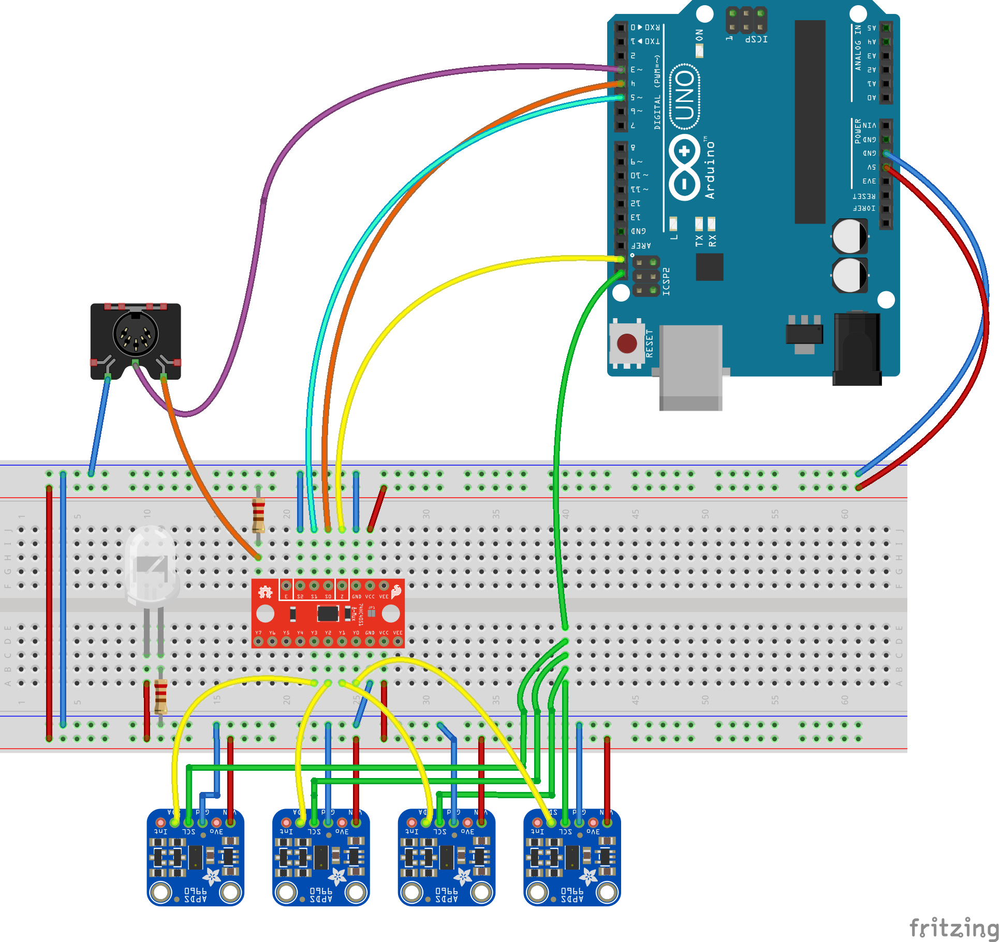
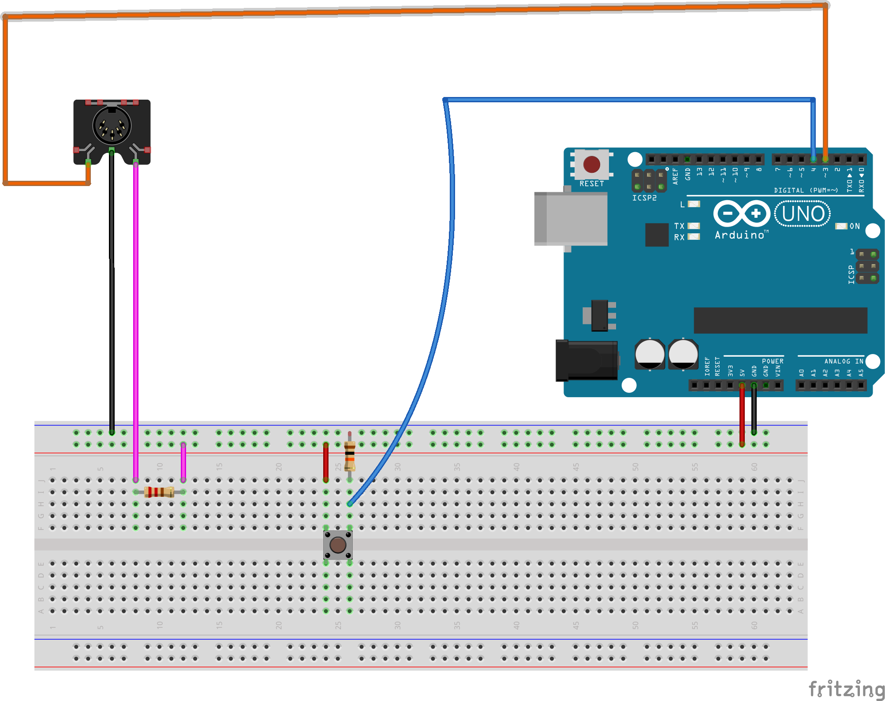

# Introduction to MIDI (Pt.2)


# So you really want to play with MIDI?

Thanks for making this far in this tutorial!

In the first part, we looked into what MIDI is, some of its history and how you can anyone hook up a MIDI controller to your computer and play around with it. Here we are going to get into the nitty gritty of creating a MIDI controller with Arduino for creative programming projects. 

If that's not what you need, you can stop here and enjoy the this classic hip-hop track that I've shared for you below. 

[The Message by Grandmaster Flash & The Furious Five](https://www.youtube.com/watch?v=PobrSpMwKk4)

For those who about to rock with Arduino and MIDI, I salute you! Let's get going.

## Things you will need to get started
* Your computer
* An Arduino Uno
* A momentary switch
* 5-pin Female MIDI Socket
* 220-ohm and 10k-ohm Resistors
* A breadboard

### The schematic from Sprint #1

I'm just showing off here, a little. This is the circuit I used for Sprint #2. We are going to do something even more basic so that you can scale things up yourself if you want to. 



### The actual schematic for the tutorial.



# The Code

I've added comments in the code to help you understand what is what. If you have any questions feel free to check the links I've provided below for more information or to ask me in person! 

There are lot more MIDI messages out there you can play with other than note on note off. If you want to control different parameters in your DAW like filter frequency, modulation, attack, sustain, release, decay, reverb send, etc. You can look into CC messages and try adding an Analog input component like an potentiometer and working with it. I'm not going to go super in-depth to scare you off.  

```
// Serial MIDI Dependencies
#include <SoftwareSerial.h>

// Button Input
#define BUTTON_PIN 4

// Software Serial Instance
SoftwareSerial midiSerial(2,3); 

// Boolean to keep check if the button is still being pressed
bool buttonPressed = false;

// Variable to read the button state
int currentSwitchState = 0;

// MIDI Note Variables
byte MIDI_Note = 60;

void setup() {  

  pinMode(BUTTON_PIN, INPUT);

  // Serial Begin
  Serial.begin(115200);
  midiSerial.begin(31250);
  
  // For those about to rock I salute you!
  Serial.println("Adventures on my simple tutorial on creating a Arduino MIDI controller");
  Serial.println("Have fun and don't forget to make some noise!");
  
}

void loop() {
  // Read the button state
  currentSwitchState = digitalRead(BUTTON_PIN);
  
  if(currentSwitchState == 1){
    if(!buttonPressed) {
      // Button is pressed send play note
      buttonPressed = true;

      // 0x90 refers to a message that plays or stops notes
      // We use our prespecified MIDI Note byte but you can change that if you want
      // 0x40 refers to the velocity of 64, you can also play with this if you want to get louder
      sendMIDIMessage(0x90, MIDI_Note,0x40);
      }
    } else {
      if(buttonPressed)
      {
      // Button is released stop notes
      // If you send a MIDI Note message with 0x00 velocity the note is stopped by the synthesizer
      sendMIDIMessage(0x90, MIDI_Note,0x00);
      buttonPressed = false;
      }
    }
}

  //  Sends a MIDI message through the MIDI Socket. 
  // Warning: This function doesn't check to see that cmd parameter is greater than 127
  // Warning: This function also doesn't chech to see if the data values are less than 127
  // FYI: These parameters are supposed to be between 0 - 127
  // Read more about MIDI messages if you are interested in learning why!
  
  void sendMIDIMessage(byte cmd, byte data1, byte data2) {
    midiSerial.write(cmd);
    midiSerial.write(data1);
    midiSerial.write(data2);

     //prints the values in the serial monitor to feast our eyes with our progress
    Serial.print("Command: ");
    Serial.print(cmd);
    Serial.print(", Data 1: ");
    Serial.print(data1);
    Serial.print(", Data 2: ");
    Serial.println(data2);
}
```

# More Reading Material

[Another basic Arduino tutorial](http://itp.nyu.edu/physcomp/labs/labs-serial-communication/lab-midi-output-using-an-arduino/)

[An Instructable tutorial to look at](https://www.instructables.com/id/Send-and-Receive-MIDI-with-Arduino/)

[Parts Not Included also makes nice tutorials](https://www.partsnotincluded.com/arduino/how-to-control-anything-on-arduino-using-midi/)

[You can never go wrong with Hackaday Tutorials](https://hackaday.com/2019/04/06/make-your-own-midi-controller-with-an-arduino/)

[If you want to create a USB Controller I found this tutorial really helpful](http://blog.stekgreif.com/?p=699)

[MIDI Message Codes Explained](http://www.songstuff.com/recording/article/midi_message_format/)

[Arduino MIDI Library used to create a USB MIDI Controller](http://fortyseveneffects.github.io/arduino_midi_library/)

